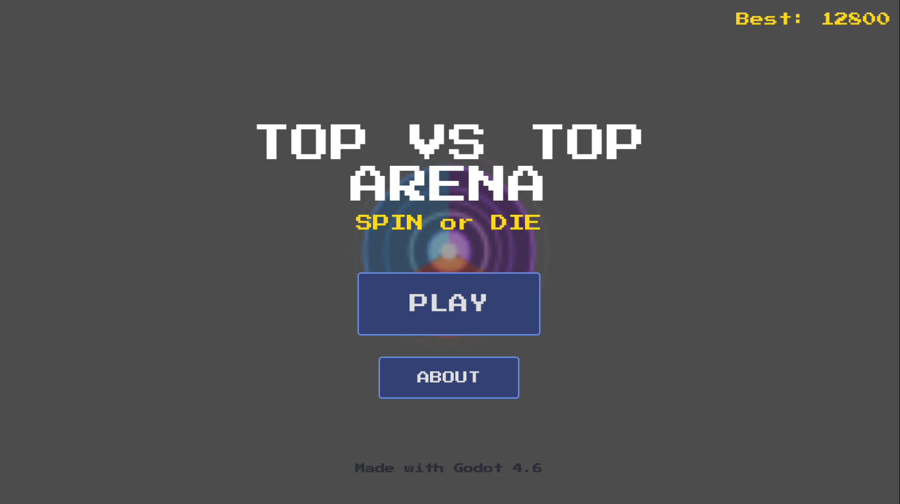

# TOP VS TOP

> A top-down arena brawler where you play as a spinning top. Your spin is your health — keep it alive or die trying.

---

## How to Play

**WASD** or **Arrow Keys** — Move (costs spin)  
**F11** / **Alt+Enter** — Toggle Fullscreen

Colliding into enemies is your only attack — both of you lose spin on hit.

---

## The Rules

- Your spin starts at **500** (max **600**). It constantly decays.
- Moving drains spin faster. Standing still slows the drain.
- **White rings** spawn each wave, grab them for **+120 spin**.
- Rings last **8 seconds**. Next one spawns **2s** after pick up.
- Enemies come in waves. Each wave has +1 enemy.
- **Purple elites** appear from wave 3: stronger, faster, worth more points.
- Killing enemies: **75 × wave** (regular), **200 × wave** (elite).
- If your spin hits **0** then game over.

### Spin Meter Colors

| Color | Spin | Meaning |
|---|---|---|
| Green | > 300 | Safe |
| Yellow | > 150 | Warning |
| Red | < 150 | Danger (pulsing!) |

---

## Download

Grab the latest build from [Releases](https://github.com/abhinab-choudhury/top-vs-top/releases).

---

## Built With

- **Godot 4.6**
- **Press Start 2P** font by CodeMan38
