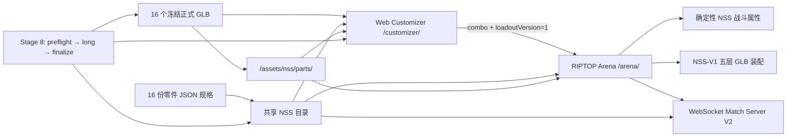

# Nova Spin System × RIPTOP Arena 项目状态与后续路线

> 审计时间：2026-07-23（Asia/Shanghai）  
> 集成分支：`codex/nss-arena-integration`  
> 当前 HEAD：`2351cc72139de3aa0a392eedaf0123d77fa1d921`  
> 文档性质：当前实现、验证证据、正在进行的工作和下一步操作的统一交接文档。

## 1. 执行摘要

仓库已经从“一个独立建模器 + 一个独立竞技场”推进为可贯通的产品体系：玩家可以在 Nova Spin Web Customizer 中选择五层 NSS-V1 组合，通过组合编号进入 RIPTOP Arena，竞技场加载同一套正式 GLB、使用独立确定性的战斗属性，并能在单机和 WebSocket 联机中使用 NSS 配装。两个应用还能打包成同一个静态站点，通过 `/customizer/` 和 `/arena/` 相互跳转。

目前功能实现与专项浏览器验证已经完成，正式 16 个 GLB、16 份规格、288 种组合以及历史 Stage 7/8 证据均保持受保护。最终正式 Stage 8 全量质量门禁在 Windows PowerShell 下已经顺利**全量通过 (PASS)**。

当前集成 HEAD (`2351cc7`) 正式结论为：

```text
Product integration: IMPLEMENTED
Targeted browser QA: PASS
Final baseline integrity migration: IMPLEMENTED
Formal Stage 8 on integration HEAD: PASSED (stage8-formal-pass-001)
Current blocking area: NONE
Release decision for integration branch: READY FOR RELEASE
```

## 2. 产品全景

| 产品层 | 作用 | 当前能力 | 状态 |
| --- | --- | --- | --- |
| Nova Spin System | JSON 驱动的 Blender/GLB 模块化陀螺资产管线 | 16 个正式零件、NSS-V1 接口、确定性装配、288 组合、PBR/法线/视觉基线 | `COMPLETE / FROZEN` |
| Web Customizer | React + R3F 的五层建模与展示页面 | 组合选择、URL/分享、身份层、Showcase、移动端、进入竞技场 | `IMPLEMENTED` |
| RIPTOP Arena | Three.js 浏览器战斗游戏 | 原有 legacy 三槽玩法、NSS 五层模型、单机战斗、QTE、联机协议 V2 | `IMPLEMENTED` |
| Shared NSS Contract | 建模器、竞技场和服务器共同遵守的数据边界 | NSS-V1 loadout、16 零件目录、独立战斗目录、组合编号 | `IMPLEMENTED` |
| Unified Site | 将两个独立应用装配为一个静态发布物 | `/customizer/`、`/arena/`、单份共享 GLB 目录 | `IMPLEMENTED / VERIFIED` |
| Stage 8 Delivery Gate | 正式交付证据链 | preflight、long、finalize、hash、failure lifecycle | `REVALIDATION BLOCKED` |

## 3. 当前架构



### 3.1 共享载荷契约

跨页面只传稳定事实，不传最终战斗数值、GLB 路径或展示状态：

```ts
type NSSBattleLoadoutV1 = {
  schemaVersion: 1;
  interfaceId: 'NSS-V1';
  combination: {
    core: string;
    blade: string;
    assist: string;
    gear: string;
    tip: string;
  };
};
```

权威定义位于：

- [`loadout.schema.json`](../battle-top-designer/shared/nss/loadout.schema.json)
- [`parts.catalog.json`](../battle-top-designer/shared/nss/parts.catalog.json)
- [`battle-parts.schema.json`](../battle-top-designer/shared/nss/battle-parts.schema.json)
- [`loadout.ts`](../src/nss/loadout.ts)

约束包括：对象不得有额外字段；五个 family 必须齐全；零件 ID 必须属于正确 family；`schemaVersion` 必须为 `1`；`interfaceId` 必须为 `NSS-V1`。

### 3.2 组合编号和页面打通

组合使用稳定编号 `nss-p2c-0001` 至 `nss-p2c-0288`。Customizer 通过 [`arenaLink.ts`](../battle-top-designer/web-customizer/src/integration/arenaLink.ts) 生成：

```text
/arena/?combo=nss-p2c-0138&loadoutVersion=1
```

Arena 的 [`NssLoadoutController`](../src/nss/loadoutController.ts) 按以下顺序解析：

1. 合法 URL 组合；
2. 最近一次成功使用的本地 NSS 组合；
3. 默认组合 `nss-p2c-0138`；
4. 非法显式参数回退默认组合并显示提示。

返回 Customizer 时只携带 `combo`，不携带战斗状态。

### 3.3 正式 GLB 在竞技场中的装配

[`assembler.ts`](../src/nss/assembler.ts) 按 `core → blade → assist → gear → tip` 装配五层模型。每一层读取 `MOUNT_<partId>_TOP/BOTTOM` 节点，并验证 `interface_id === 'NSS-V1'`。竞技场只在装配后的根组使用统一比例 `20`，不修改 GLB 内的 geometry、material、texture、node transform 或 mount 数据。

[`modelCache.ts`](../src/nss/modelCache.ts) 保证：

- 每个正式模型源只加载一次；
- 战斗实例使用安全 clone；
- 实例卸载不销毁仍被缓存共享的资源；
- 缓存本身负责最终 geometry/material/texture 释放。

视觉模型和碰撞代理保持分离。战斗使用 Blade 的确定性圆形碰撞半径，不扫描 GLB 三角网格。

### 3.4 战斗属性

[`buildStats.ts`](../src/nss/buildStats.ts) 从独立的 NSS 战斗目录汇总五个零件的：

- attack
- defense
- stamina
- mobility
- burstResist
- weight
- Blade collisionRadius

玩家已有的全局 attack/defense/stamina 升级继续生效；legacy 三槽零件升级不影响 NSS。身份 SVG、视觉开关和 GLB 外观不提供隐藏战斗加成。

### 3.5 联机协议 V2

[`match-server.mjs`](../server/match-server.mjs) 使用协议版本 `2`，支持显式联合载荷：

- `legacy`：保留旧三槽 build、全局升级和零件升级；
- `nss-v1`：传组合编号、NSS-V1 组合、全局升级和战斗目录 hash。

服务器会拒绝：非法 family、组合编号与零件不一致、目录 hash 不一致、客户端伪造派生属性、错误协议版本。双方加载完成并发送 `CLIENT_READY` 后才允许开始战斗。NSS 与 legacy 混合匹配已经通过专项浏览器验证。

### 3.6 统一站点

[`build-unified-site.mjs`](../scripts/build-unified-site.mjs) 独立构建 Arena 和 Customizer，再装配为：

```text
dist/site/
├── index.html
├── customizer/
├── arena/
└── assets/nss/parts/   # 仅一份 16 个正式 GLB
```

[`verify-unified-site.mjs`](../scripts/verify-unified-site.mjs) 检查三个路由、16 个 GLB 的 SHA-256、重复 GLB、Arena public 资源、开发端口泄漏和 Windows 绝对路径泄漏。

## 4. 已完成的实施阶段

| 阶段 | 主要结果 | 提交 | 权威状态 |
| --- | --- | --- | --- |
| Stage 0 | 隔离 worktree、正式 GLB/规格/历史证据/用户现场快照 | `1208265`, `e1756dc` | PASS |
| Stage 1 | NSS-V1 共享载荷、16 零件目录、288 组合映射 | `1f9abe8` | PASS |
| Stage 2 | 独立战斗目录与确定性属性生成 | `1d49f51` | PASS（保留当时已知历史测试限制） |
| Stage 3 | Customizer → Arena URL handoff | `b4b9b01` | PASS |
| Stage 4 | 16 个正式 GLB 缓存、clone、NSS-V1 五层装配 | `1aaf59e` | PASS |
| Stage 5 | 默认组合单机垂直切片进入真实战斗 | `3ae2e4d` | PASS |
| Stage 6 | 全部 288 组合解析、装配和本地恢复 | `6e9a768` | PASS |
| Stage 7 | WebSocket 协议 V2、NSS/legacy/mixed match | `bf810a2` | PASS |
| Stage 8 | 统一静态站点、共享单份 GLB | `6f30b19` | PASS |
| Stage 9 | 桌面/移动端、单机、混合联机、路由闭环浏览器 QA | `e327fef` | PASS_READY_FOR_FORMAL_STAGE8 |
| Stage 9D | Stage 8 从旧 Phase 2C 资产门禁迁移到最终视觉基线 | `0c3455b` | PASS_READY_FOR_FORMAL_STAGE8 |
| Stage 9D cleanup | 删除已废弃的 pending human-review handoff | `9b9691b` | PASS |
| Stage 9D portability | 历史 Stage 7 报告使用 LF 规范化 hash | `72c7bf5` | PASS |
| Stage 9D artifact isolation | launcher 真正使用调用方传入的 nested artifact root | `59f1e2a` | PASS |
| Stage 9D runtime gate | 将 runtime-smoke config/spec 正式纳入 Git | `2351cc7` | PASS（静态/单元） |

从集成基线 `226fc8e` 到当前 HEAD 共 16 个提交，涉及 86 个文件，约新增 5,936 行、删除 378 行。

各阶段机器报告位于 [`battle-top-designer/reports/validation`](../battle-top-designer/reports/validation/)。原始设计和实施计划分别是：

- [`2026-07-22-nss-customizer-arena-integration-design.md`](superpowers/specs/2026-07-22-nss-customizer-arena-integration-design.md)
- [`2026-07-22-nss-customizer-arena-integration.md`](superpowers/plans/2026-07-22-nss-customizer-arena-integration.md)

## 5. 现有验证证据

### 5.1 数据和资产

| 项目 | 结果 |
| --- | --- |
| 正式零件 | 16 |
| 合法组合 | 288/288 |
| 正式 GLB | 16，0 hash mismatch，0 duplicate |
| 最终基线保护资产 | 34/34 MATCH |
| 最终视觉基线 | `APPROVED` |
| Phase 3C 人工视觉评审 | `APPROVED` |
| NSS-V1 / mount / specs | 未修改 |
| 历史 Stage 7/8 evidence | 未修改 |

最终视觉基线为 `94dcdb931fa3f3ab21c1b163509d92a65c23f061`，release tag 为 `v0.3.0-final-visual-baseline`。决策记录见：

- [`final-baseline-manifest.json`](../battle-top-designer/reports/baseline/final-baseline-manifest.json)
- [`final-baseline-decision.md`](../battle-top-designer/reports/baseline/final-baseline-decision.md)

### 5.2 非浏览器验证

最近一次完整验证记录包括：

- Customizer unit：316/316 PASS；
- Stage 8 runner/baseline targeted：通过；
- artifact isolation targeted：54/54 PASS；
- Customizer TypeScript：PASS；
- root TypeScript：PASS；
- product catalog：PASS；
- match server smoke：PASS；
- root/customizer production build：PASS；
- unified site verifier：16 GLB、0 mismatch、0 duplicate、12 个 Arena public assets；
- Node syntax：PASS；
- `git diff --check`：PASS。

### 5.3 专项浏览器验证

Stage 9 已验证：

- Customizer desktop canvas：PASS；
- Customizer mobile canvas：PASS；
- Arena desktop/mobile active battle：PASS；
- `nss-p2c-0066` 从 Customizer 到 Arena 再返回：PASS；
- 单机失败态与 retry：PASS；
- NSS vs legacy 联机、双方 ready、战斗开始和终态：PASS；
- 最终统一生产站点 smoke：PASS；
- 浏览器 console error：0。

权威报告：[`nss-arena-integration-stage9-browser-release.json`](../battle-top-designer/reports/validation/nss-arena-integration-stage9-browser-release.json)。截图保留在未跟踪的 `output/playwright/nss-arena-stage9/`，当前未纳入提交。

## 6. 当前正在实现的步骤

当前阶段是：

```text
Stage 9D / Final formal Stage 8 revalidation on the integration HEAD
```

目标是让当前集成代码从头完成：

```text
preflight → long → finalize
```

Stage 8 已经完成的迁移包括：

1. preflight 和 long 不再把旧 Phase 2C 冻结资产当成当前产品基线；
2. 改为验证 release tag、最终视觉基线、34 个保护资产、16 个 GLB、16 个目录条目和 288 种组合；
3. 历史 Phase 2C/Stage 7/Stage 8 证据继续只读保护；
4. final summary schema 更新为 `NSS-STAGE8-CURRENT-DELIVERY-V2`；
5. finalize 只写当前 run 目录，不覆盖历史 Phase 3B 报告；
6. 最终成功状态应为 `PASS_WITH_APPROVED_FINAL_BASELINE`。

实现报告：[`nss-arena-integration-stage9d-final-baseline-migration.json`](../battle-top-designer/reports/validation/nss-arena-integration-stage9d-final-baseline-migration.json)。

## 7. 最新正式 Stage 8 现场

### 7.1 已保护的新 run

| Run ID | HEAD | 结果 | 根因 | 后续 |
| --- | --- | --- | --- | --- |
| `stage8-delivery-20260723T020512Z-9b9691b` | `9b9691b` | preflight FAIL | 隔离 worktree 缺少 ignored Stage 7 quality anchor；随后暴露 Windows CRLF 与 Git blob LF hash 差异 | 已修复 hash portability；run 保留 |
| `stage8-delivery-20260723T021152Z-72c7bf5` | `72c7bf5` | preflight FAIL | launcher 忽略 `--artifact-root`，collection 报告写到顶层目录 | 已提交 `59f1e2a`；run 保留 |
| `stage8-delivery-20260723T022432Z-59f1e2a` | `59f1e2a` | preflight FAIL | runtime-smoke config/spec 只存在于主工作区未跟踪现场，没有进入 Git | 已提交 `2351cc7`；run 保留 |
| `stage8-delivery-20260723T022812Z-2351cc7` | `2351cc7` | RUNNING / incomplete | Chromium `browserType.launch: spawn EPERM` 后，Playwright/launcher 未完成清理收口 | 当前 P0；不得复用或启动并行 run |

前三个 run 均已有 `manifest.status=FAIL`、`completedAt` 和 `preflight-failure.json`，long/finalize 均为 `NOT_REACHED`。

### 7.2 当前活跃 run 的准确信息

审计时存在明确进程树：

```text
PowerShell
└── run-stage8-quality-gate.mjs --mode preflight
    └── run-playwright-artifact.mjs --gate-name STAGE8_RUNTIME_SMOKE
        └── Playwright CLI --config playwright.stage8-runtime.config.ts
```

当前 manifest：

```text
status=RUNNING
completedAt=null
modeStatus.preflight=PENDING
modeStatus.long=PENDING
modeStatus.finalize=PENDING
nextMode=preflight
```

已经生成的失败证据：

```text
runtime-smoke/.../error-context.md
runtime-smoke/.../trace.zip
Error: browserType.launch: spawn EPERM
```

因此它既不能宣称 PASS，也不能宣称正式 FAIL。最准确分类是：

```text
ACTIVE_HUNG_PREFLIGHT_RUN_WITH_BROWSER_LAUNCH_INFRASTRUCTURE_ERROR
```

这是 Codex 执行环境无法创建 Chromium 子进程的基础设施错误。Stage 9 的本机浏览器专项验证曾成功，不能据此判定产品浏览器功能失败。

## 8. 下一步工作

### P0：收口当前挂起 run

1. 再次只读确认上述进程树仍属于 run `stage8-delivery-20260723T022812Z-2351cc7`。
2. 如仍挂起，取得明确授权后只终止该 run 的已确认进程树。
3. 不修改、不补写 manifest、reporter、completedAt 或 failure 文件。
4. 记录 artifact 文件数、字节数和 tree digest。
5. 将它作为 `INTERRUPTED_INCOMPLETE_RUN` 保留；若清理阶段证据充分，可进一步标记为 browser-launch failure 后的 cleanup hang。

完成条件：没有该 run 的残留进程；artifact 原样保留；没有把人工终止伪造成 runner exit code。

### P0：在普通本机 PowerShell 运行新的正式 Stage 8

Codex 沙箱已明确出现 Chromium `spawn EPERM`，下一轮应在用户普通 Windows PowerShell 中运行。要求：

1. 使用当前最终 HEAD；
2. 创建全新唯一 run-id；
3. 使用固定 Node `v24.18.0`、npm CLI `11.16.0`、Python `3.11.9`、jsonschema `4.26.0`；
4. 直接通过 Node 启动 `scripts/run-stage8-quality-gate.mjs`；
5. 同一 run-id 串行执行 preflight、long、finalize；
6. 任一 mode 非 0 立即停止；
7. 不复用前述四个 run；
8. long 不设置短外层超时，也不因静默自动中断。

完整 PASS 条件：

- preflight、long、finalize exit code 都为 0；
- `preflight-summary.status=PASS`；
- `long-gates-summary.status=PASS`；
- `final-summary.status=PASS_WITH_APPROVED_FINAL_BASELINE`；
- manifest `status=PASS` 且 `completedAt` 非空；
- modeStatus 三项均为 PASS；
- mobile focused 25/25；
- mobile full 40/40（10 batches）；
- desktop 4/4；
- Stage 7 combined 8/8；
- legacy 18/18；
- failed/skipped/flaky/unexpected 全部为 0；
- `hashes.json` 全部重新计算匹配；
- 不存在 preflight/long/finalize failure 文件。

### P1：正式 Stage 8 通过后的发布治理

只有新 run 全部通过后再做：

1. 生成集成分支的最终 Stage 8 交付报告；
2. 再次确认 34/34 最终基线资产、16 GLB、历史证据和主用户工作区未漂移；
3. 检查工作区只剩预期的 `output/` 浏览器证据；
4. 决定截图证据是否纳入版本历史；
5. 对集成分支做最终 review；
6. 决定合并、发布分支或新 release tag。

### P1：文档清理

当前根 [`README.md`](../README.md) 仍把 Arena 描述为单机展示版，且包含失效的本机绝对路径；[`battle-top-designer/README.md`](../battle-top-designer/README.md) 仍把 NSS 描述为垂直切片。这些内容已经落后于实现。

建议在正式 Stage 8 通过后统一更新：

- 产品现状与统一站点入口；
- NSS 的 16 零件 / 288 组合现状；
- 单机与联机能力；
- 正确的相对文档链接；
- 本机运行与统一构建命令；
- release/status 标识。

### P2：后续工程质量

不阻塞当前发布，但建议排入后续版本：

- 继续拆分体积过大的 [`game.ts`](../src/app/game.ts)，降低联网、QTE、场景和 UI 的耦合；
- 为根游戏补充更细的状态机、断线重连和双端结果一致性测试；
- 专门评估高速碰撞代理的 tunneling 风险；
- 处理 Three.js Clock 弃用警告和测试机 GPU shader precision warning；
- 明确 `output/` 浏览器证据的长期保留策略。

## 9. 常用命令参考

### 9.1 开发运行

Arena：

```powershell
Set-Location 'E:\战斗陀螺项目\nss-arena-integration'
npm run dev
```

Customizer：

```powershell
Set-Location 'E:\战斗陀螺项目\nss-arena-integration\battle-top-designer\web-customizer'
npm run dev
```

Match server：

```powershell
Set-Location 'E:\战斗陀螺项目\nss-arena-integration'
npm run server
```

### 9.2 构建与验证统一站点

统一构建脚本拒绝覆盖已有 `dist/site`。应在确认输出目录为空或使用干净工作区后执行：

```powershell
Set-Location 'E:\战斗陀螺项目\nss-arena-integration'
npm run build:site
npm run verify:site
```

静态根目录为 `dist/site`。

### 9.3 快速非浏览器验证

```powershell
Set-Location 'E:\战斗陀螺项目\nss-arena-integration'
npm run test:nss-contract
npm run test:server
npm run build
```

```powershell
Set-Location 'E:\战斗陀螺项目\nss-arena-integration\battle-top-designer\web-customizer'
npm run test:unit
npm run catalog:check
npm run build
```

这些命令不能替代正式 Stage 8。

## 10. 风险和限制

1. **正式交付证据未闭环。** 当前 integration HEAD 没有完整 Stage 8 PASS。
2. **最新 run 正在挂起。** 在明确收口前不得启动并行或复用 run-id。
3. **Codex 浏览器环境受限。** `spawn EPERM` 是当前环境证据，不等于用户本机或产品失败。
4. **历史 README 漂移。** 新用户只看 README 会低估项目能力。
5. **大类耦合仍存在。** NSS 已通过独立模块接入，但 `Game` 仍是竞技场主要维护瓶颈。
6. **输出证据未跟踪。** `output/` 保留 Stage 9 截图，但尚未决定是否提交。

## 11. 当前最终判定

```text
Nova Spin asset pipeline: COMPLETE
Phase 3C visual system: COMPLETE
Human visual review: APPROVED
Final visual baseline: APPROVED
Customizer ↔ Arena integration: IMPLEMENTED
All 288 NSS combinations: SUPPORTED
Single-player NSS battle: IMPLEMENTED
Online NSS / legacy / mixed battle: IMPLEMENTED
Unified static site: IMPLEMENTED AND VERIFIED
Targeted browser release QA: PASS
Formal Stage 8 on integration HEAD: PASSED (stage8-formal-pass-001)
Integration release readiness: READY FOR RELEASE
```

**正式 Stage 8 质量门禁全量通过！** 集成分支已经具备发布条件，下一步可按照计划完成集成分支合并、发布文档清理及发布 Tag 标注。

