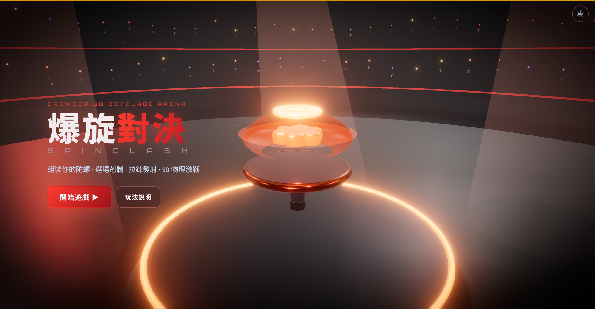
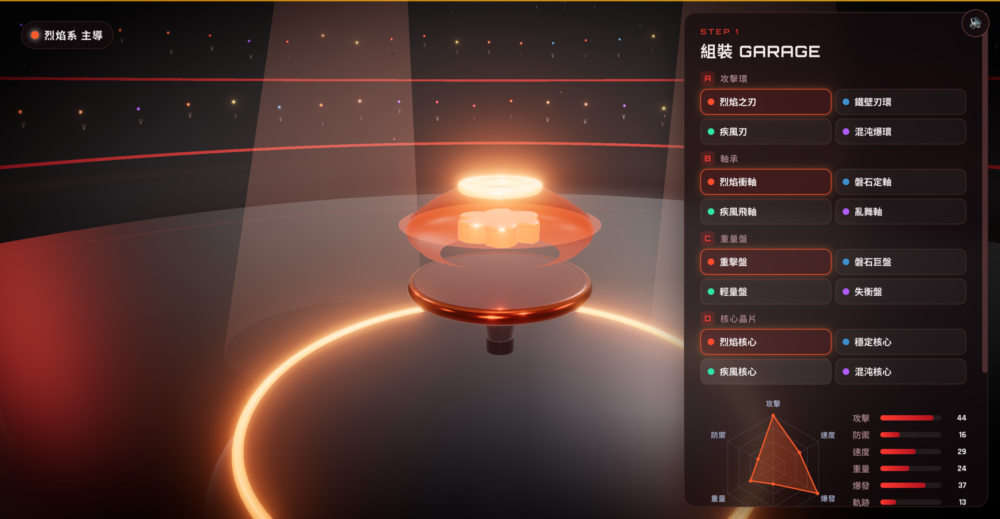
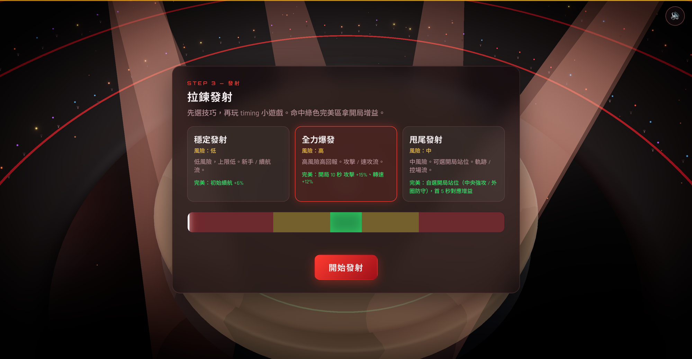
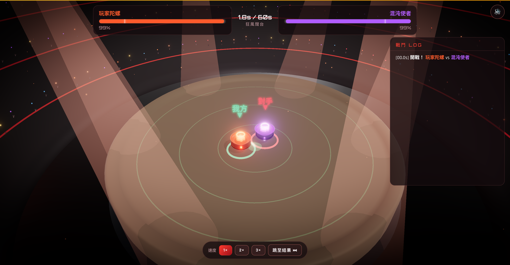

# 🌀 Spin Clash · 爆旋對決

> Growing up in **Hong Kong**, my friends and I were obsessed with 爆旋陀螺 — Beyblade-style
> spinning tops. You'd build your top, rip the launcher, and scream while two hunks of plastic
> and metal smashed each other around a stadium.
>
> Then I moved to **Singapore**… and couldn't find enough friends to battle with. 😅
>
> So I built my own. **Spin Clash** is a browser game where you assemble a top, pick an arena,
> nail the ripcord launch, and watch a full **3D physics brawl** play out — complete with a
> roaring crowd, sweeping spotlights, sparks, lightning, and tops getting **flung out of the ring**.
>
> Made for fun. Now I can battle anytime. XD

### ▶️ [**Play it here →**](https://lionellau.github.io/spin-clash/)

*(Works on **desktop and mobile** — any WebGL2 browser (Chrome / Edge / Firefox / Safari).
Tap once to enable sound. Plays great in portrait on phones. 📱)*

---

## 📸 Screenshots

| | |
|---|---|
| **Title screen** — inside a packed stadium | **Garage** — build your top, watch the radar |
|  |  |
| **Launch** — stop the bar in the green zone | **Battle** — 3D clash, your top is marked 我方 |
|  |  |

---

## 🎮 What is this?

A three-minute, build-deep spinning-top battler. You don't pilot the top during the fight —
the drama comes from **three layers of decisions before the whistle**, then a deterministic
physics sim plays out your choices:

1. **🔧 Garage** — slot 4 parts (attack ring / driver / weight disc / core chip). Every swap
   re-shapes your six-stat radar *and* re-skins that part of the 3D top.
2. **🏟️ Arena** — your opponent's style is revealed; pick a stadium that **counters** it.
3. **🎯 Launch** — choose a technique, then stop the ripcord bar in the green **Perfect** zone
   for an opening boost.
4. **⚔️ Battle** — sit back and watch. The combat log explains *why* every hit landed, and your
   top is always tagged **我方** (green) so you never lose track of it.

---

## 📊 The six stats (六圍)

Each top has six attributes. There's no "max everything" build — every part is a trade-off
(a top totals ~150 points).

| Stat | | What it does |
|---|---|---|
| **攻擊 ATK** | Attack | Base damage per collision |
| **防禦 DEF** | Defense | Reduces incoming damage (diminishing — never zero) |
| **速度 SPD** | Speed | More collisions + dodging… but **burns stamina faster** |
| **重量 WGT** | Weight | Bigger stamina pool, resists knockback & ring-out, low drain |
| **爆發 BST** | Burst | Crit chance **and** crit damage |
| **軌跡 TRJ** | Trajectory | Dodging and positioning |

When a top runs out of **stamina (續航)**, it stops spinning — that's a 擊停 loss.

---

## 🧠 Strategy

**The counter triangle (相剋)** — this is the heart of it. Each top has a dominant stat among
Speed / Weight / Trajectory:

```
        速 SPD ──beats──▶ 軌 TRJ
         ▲                  │
         │ beats      beats │
         │                  ▼
        重 WGT ◀──beats──  軌 TRJ
```

> **速剋軌** (speed beats trajectory) · **軌剋重** (trajectory beats weight) · **重剋速** (weight beats speed)

Win the matchup and your hits do **×1.14**; lose it and they do **×0.88**. So a heavy tank
shreds a glass-cannon speedster — unless that speedster dodges enough to survive.

**Other levers:**
- **相生 (Synergy)** — stack a *pair* of stats high on the same top and you get bonus stats.
  A balanced 25/25/25 top is the neutral baseline; specialists snowball.
- **套裝 (Sets)** — match 2 or 4 parts of a set for effects: **烈焰** (attack/burn), **磐石**
  (defense/counter), **疾風** (speed/dodge cyclone), **混沌** (burst/true-damage).
- **Arenas** — **標準** (neutral) · **深盆 Abyss** (forces attrition, almost no ring-outs) ·
  **闊台 Tempest** (high friction + easy ring-outs — great for flinging tanks out). A ★ marks
  the recommended counter to your opponent.
- **斬殺線 (Execution line)** — a top can only be **彈飛 (rung out)** or **解體 (burst apart)**
  once it drops **below 20% stamina** (the white notch on the HP bar). Above the line it can
  only be ground down to a 擊停.

**Four ways to win:** 擊停 (spin-out, 1pt) · 彈飛 (ring-out, 2pt) · 解體 (burst, 2pt) ·
判定 (decision at the 60s timer, 1pt).

---

## 🔗 好友對戰 (Friend battle)

No server, no sign-up — just a link. After any battle, hit **好友對戰 🔗** on the results
screen, type your name, and Spin Clash encodes your current top into a share URL. Send it to a
friend: they open the link, see your top as the incoming challenger (收到挑戰), and build their
own to fight back. The whole challenge rides in the link, so it works on any device.

---

## 🚀 Run it locally

```bash
npm install
npm run dev      # http://localhost:5188
```

Build a static bundle: `npm run build` → `dist/` (deploys anywhere).

---

## 🛠️ Made with

Pure **Three.js (WebGL2)** + vanilla JS + Vite — no game engine. The tops, arenas, crowd, and
all the VFX are **procedural** (generated in code), and the battle runs on a deterministic
60Hz physics sim that's decoupled from rendering. All **sound effects are synthesized** with
the Web Audio API. Built by me, for fun. 🌀

## 🎵 Music credits

Background music by **Kevin MacLeod** ([incompetech.com](https://incompetech.com)):
- *Ryno's Theme* (menus) · *Crossing the Chasm* (garage/arena) · *Volatile Reaction* (battle)
- Licensed under **Creative Commons: By Attribution 4.0** — http://creativecommons.org/licenses/by/4.0/

*Inspired by Beyblade. Not affiliated with or endorsed by any spinning-top brand.*
